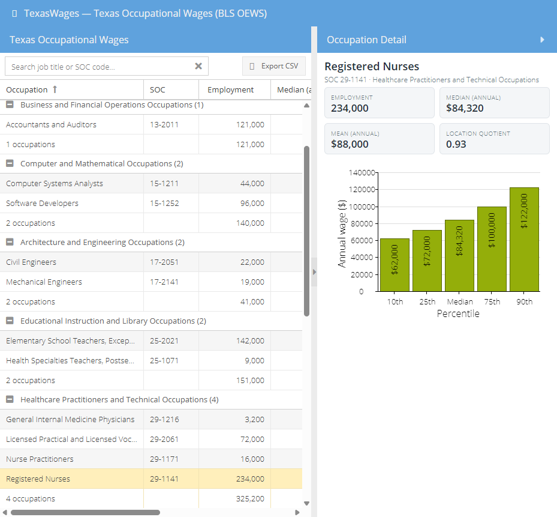

# TexasWages — Texas Occupational Wage Explorer

A fast, searchable dashboard for exploring **Texas occupational wages and employment** from the
U.S. Bureau of Labor Statistics **OEWS** (Occupational Employment and Wage Statistics) program.
Type in a trade, job title, or SOC code and instantly see Texas pay, employment, and the full
wage-percentile spread — a purpose-built alternative to spelunking BLS spreadsheets in Excel.

Built with **Sencha Ext JS 7.7 (Classic toolkit)** as a **static, client-only** app — no backend,
no API keys. The data is pre-converted to a local JSON file and rendered in a high-performance
buffered grid.



## Features

- **Search** by occupation title *or* SOC code, with live filtering.
- **Grouped grid** by SOC major group, with per-group summaries (occupation count, total employment).
- **Per-column filters**, sorting, and column show/hide.
- **Detail panel** with KPI tiles (employment, median/mean annual wage, location quotient) and a
  **wage-percentile bar chart** (10th / 25th / median / 75th / 90th) for the selected occupation.
- **CSV export** of the current (filtered) view.
- Graceful handling of BLS suppression: top-coded wages render as `≥ $239,200`, unavailable values as `—`.

## Tech stack

- **Ext JS 7.7.0** (Classic toolkit, open-source/GPL build) + **Sencha Cmd 7.7.0.36**
- MVVM (view + ViewController + ViewModel), `Ext.chart` for the chart, buffered grid rendering
- **Python** (pandas / openpyxl / jsonschema) for the one-time data pipeline
- **pytest** (pipeline unit tests) + **Playwright** (end-to-end tests)

## Data

- Source: **U.S. Bureau of Labor Statistics, OEWS — Texas statewide**, May 2025 estimates.
- BLS data is in the **public domain**. Attribution: *Source: U.S. Bureau of Labor Statistics.*
- The repo currently ships a small **hand-authored sample dataset** (`resources/data/tx_oews.json`,
  21 occupations) so the app runs out of the box. To load the full ~800-occupation dataset:
  1. Download the state file `oesm25st.zip` from <https://www.bls.gov/oes/tables.htm> and unzip
     `state_M2025_dl.xlsx`.
  2. `python tools/convert_oews.py --input state_M2025_dl.xlsx --output resources/data/tx_oews.json`

## Run locally

> The Ext JS SDK (`ext/`) is **not** committed (it's large and rebuilt from the vendored SDK).
> You need Sencha Cmd 7.7.x and the Ext JS 7.7 SDK to build/serve.

```bash
sencha app watch      # dev server with live rebuild -> http://localhost:1841
sencha app build      # production static build -> build/production/TexasWages/
```

## Testing

```bash
# Data pipeline (pure Python units)
python -m pytest tests/pytest -q

# End-to-end (against a running `sencha app watch` on :1841)
npm install
npx playwright test
```

Playwright targets stable `data-testid` hooks (added via an `Ext.Component` override) rather than
Ext's auto-generated ids, and asserts on the grid **store** rather than the virtualized DOM.

## License

Code: **MIT** (see [LICENSE](LICENSE)). BLS OEWS data: U.S. public domain.
